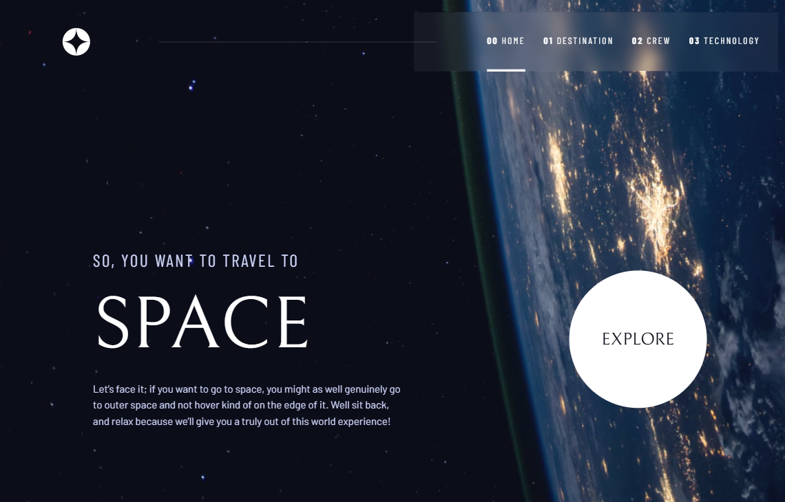
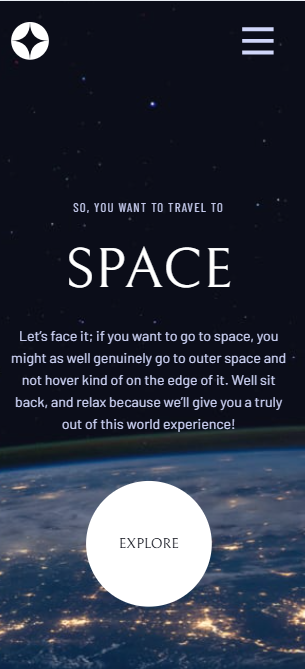
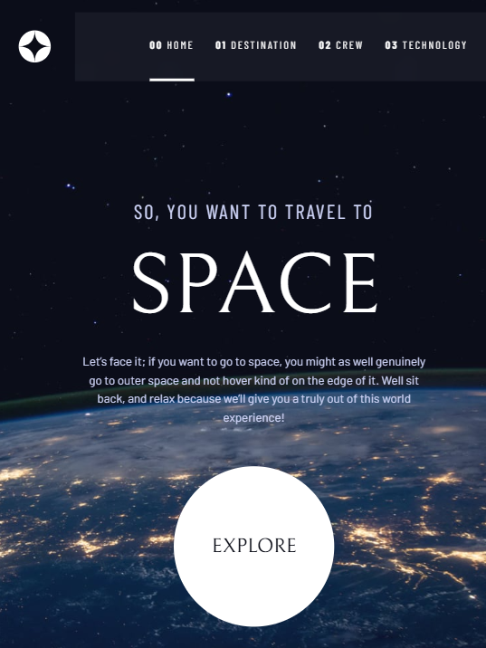

# Space tourism website

This is a solution to the [Space tourism website challenge on Frontend Mentor](https://www.frontendmentor.io/challenges/space-tourism-multipage-website-gRWj1URZ3). Frontend Mentor challenges help you improve your coding skills by building realistic projects. 

## Table of contents

- [Overview](#overview)
  - [The challenge](#the-challenge)
  - [Screenshot](#screenshot)
  - [Links](#links)
- [My process](#my-process)
  - [Built with](#built-with)
  - [What I learned](#what-i-learned)
  - [Continued development](#continued-development)
  - [Useful resources](#useful-resources)
- [Author](#author)
- [Acknowledgments](#acknowledgments)


## Overview

This project is a multi-page responsive website for a fictional space tourism company. It provides users with information about destinations, crew members, and available technology.

The project was inspired by a real world challeng where developers are tasked with building a production-grade frontend that follows modern UI?UX practices, uses scalable folder structures, and maintain accessibility.

### The challenge

Users should be able to:

- View the optimal layout for each of the website's pages depending on their device's screen size
- See hover states for all interactive elements on the page
- View each page and be able to toggle between the tabs to see new information

### Screenshot


| 🖥️ Desktop View                  | 📱 Mobile View                 |
| -------------------------------- | ------------------------------ |
|  |  |
|  |  |


### Links

- Solution URL: [Github Repo](https://github.com/Ruqayah1204/space-tourism)
- Live Site URL: [Space tourism website]()


## My process

### Built with

Built with

 React (with TypeScript) – .

⚡ Vite – fast build tool for development and production.

🎨 Tailwind CSS + Custom CSS Variables – for styling and utility classes.

🎭 ShadCN/UI Tabs & Buttons – for accessible, reusable UI components.

🌐 React Router DOM v6+ – .

🖼 Responsive Design – mobile-first with fluid layouts and flexible grids.

- **⚛️React + TypeScript** - component-based architecture for scalability
- **Vite** - fast build tool for development and production
- **Tailwind CSS + Custom CSS Variable** - for utility-first responsive styling
- **ShadCN UI** - for accessible, reusable UI components
- **React Router DOM** - for routing

### What I learned

During this project, I gained deeper experience in:
- Creating scalable folder structures for React projects.
- Implementing tab-based navigation where the UI updates dynamically (e.g., image + content switching).
- Handling state lifting (sharing active tab state between parent and child components).
- Building smooth mobile navigation menus with custom CSS animations.
- Changing the background image for each route and screen dynamically


```tsx
  const location = useLocation();

    let backgroundImg = "";

    if (location.pathname === "/") {
        backgroundImg ="bg-home-mobile md:bg-home-tablet lg:bg-home-desktop";
    } else if (location.pathname === "/destination") {
        backgroundImg = "bg-destination-mobile md:bg-destination-tablet lg:bg-destination-desktop";
    } else if (location.pathname === "/crew") {
        backgroundImg = "bg-crew-mobile md:bg-crew-tablet lg:bg-crew-desktop";
    } else if (location.pathname === "/technology") {
        backgroundImg = "bg-technology-mobile md:bg-technology-tablet lg:bg-technology-desktop";
    }

    return (
        <div className={`... ${backgroundImg}`}>

          // code here

        </div>
    )
```

### Continued development

In the future, I want to improve this project by:

+ Adding page transition animations with Framer Motion.
- Implementing dark/light theme toggle.
+ Enhancing accessibility (keyboard navigation for tabs and menus).
- Optimizing for performance (image lazy loading, caching).
+ Expanding the app to support internationalization (i18n) for multiple language


### Useful resources

- [Frontend Mentor](https://www.frontendmentor.io/challenges/space-tourism-multipage-website-gRWj1URZ3) - Original challenge source.
- [React Router Documentation](https://reactrouter.com/) - Routing and nested routes.
- [Tailwind CSS Documentation](https://tailwindcss.com/docs) - Styling utilities and responsive design.
- [ShadCN UI](https://ui.shadcn.com/) - Accessible and customizable tab & button components.


## Author

- Github - [Salaudeen Rukayat](https://github.com/Ruqayah1204)
- Twitter/X - [@RuqayahThe](https://x.com/RuqayahThe)
- LinkedIn - [@Salaudeen Rukayat](https://www.linkedin.com/in/salaudeenrukayat)


## Acknowledgments

